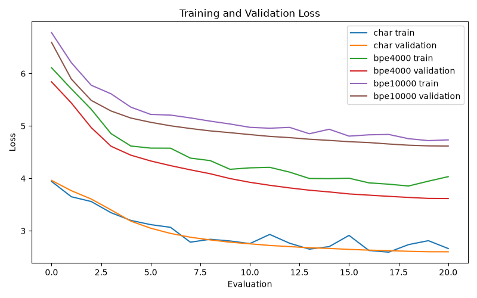

# Part 1
# setup
All tokenizers were trained using only the training data.  

The character tokenizer was built from train/*.txt. The two BPE tokenizers were trained with SentencePiece on the balanced multilingual corpus (tokenizer/balanced.txt)  

All statistics were calculated on the validation set. 

## Why 4000 and 10000 Instead of 2000 and 10000  
I originally planned to use vocabulary sizes of 2,000 and 10,000. However, training with 2,000 tokens was impossible because SentencePiece requires space for all characters needed to reach the target coverage, plus 256 byte-fallback tokens and 4 special tokens.


```
====================================================================================================
Summary Part 1
====================================================================================================
Tokenizer      Language         Vocab      Total tokens     Avg tokens/sent       Chars/token
----------------------------------------------------------------------------------------------------
Character      en                9446            368269              81.117             1.000
Character      tr                9446            368383              98.630             1.000
Character      zh                9446            368266              38.546             1.000
BPE-4000       en                4000            182648              40.231             2.016
BPE-4000       tr                4000            191276              51.212             1.926
BPE-4000       zh                4000            355153              37.173             1.037
BPE-10000      en               10000            129593              28.545             2.842
BPE-10000      tr               10000            129636              34.708             2.842
BPE-10000      zh               10000            306390              32.069             1.202


--------------------------------------------------------------------------------
Tokenization Examples
--------------------------------------------------------------------------------


--------------------------------------------------------------------------------
LANGUAGE: en
--------------------------------------------------------------------------------

Original:
She played in two matches at this championship.

Character:
['S', 'h', 'e', ' ', 'p', 'l', 'a', 'y', 'e', 'd', ' ', 'i', 'n', ' ', 't', 'w', 'o', ' ', 'm', 'a', 't', 'c', 'h', 'e', 's', ' ', 'a', 't', ' ', 't', 'h', 'i', 's', ' ', 'c', 'h', 'a', 'm', 'p', 'i', 'o', 'n', 's', 'h', 'i', 'p', '.']

BPE-4000:
['S', 'he', '▁p', 'lay', 'ed', '▁in', '▁t', 'w', 'o', '▁m', 'at', 'c', 'he', 's', '▁at', '▁th', 'is', '▁ch', 'am', 'p', 'ion', 's', 'h', 'ip', '.']

BPE-10000:
['She', '▁played', '▁in', '▁two', '▁mat', 'ches', '▁at', '▁this', '▁ch', 'ampions', 'hip', '.']


--------------------------------------------------------------------------------
LANGUAGE: tr
--------------------------------------------------------------------------------

Original:
Germantown akademisine devam ettikten sonra 1869-1870 yılları Fransa ve Almanya'da okullarda geçti.

Character:
['G', 'e', 'r', 'm', 'a', 'n', 't', 'o', 'w', 'n', ' ', 'a', 'k', 'a', 'd', 'e', 'm', 'i', 's', 'i', 'n', 'e', ' ', 'd', 'e', 'v', 'a', 'm', ' ', 'e', 't', 't', 'i', 'k', 't', 'e', 'n', ' ', 's', 'o', 'n', 'r', 'a', ' ', '1', '8', '6', '9', '-', '1', '8', '7', '0', ' ', 'y', 'ı', 'l', 'l', 'a', 'r', 'ı', ' ', 'F', 'r', 'a', 'n', 's', 'a', ' ', 'v','e', ' ', 'A', 'l', 'm', 'a', 'n', 'y', 'a', "'", 'd', 'a', ' ', 'o', 'k', 'u', 'l', 'l', 'a', 'r', 'd', 'a', ' ', 'g', 'e', 'ç', 't', 'i', '.']

BPE-4000:
['G', 'er', 'man', 't', 'ow', 'n', '▁a', 'k', 'ad', 'em', 'is', 'ine', '▁d', 'ev', 'am', '▁et', 't', 'ik', 't', 'en', '▁sonra', '▁1', '8', '6', '9', '-', '18', '7', '0', '▁yıl', 'ları', '▁F', 'r', 'ans', 'a', '▁ve', '▁A', 'l', 'man','ya', "'", 'da', '▁o', 'k', 'ul', 'lar', 'da', '▁g', 'e', 'ç', 'ti', '.']

BPE-10000:
['G', 'er', 'man', 't', 'own', '▁ak', 'adem', 'isine', '▁devam', '▁et', 't', 'ik', 'ten', '▁sonra', '▁18', '6', '9','-', '18', '70', '▁yıl', 'ları', '▁Frans', 'a', '▁ve', '▁Alman', 'ya', "'", 'da', '▁ok', 'ul', 'larda', '▁geç', 'ti', '.']


--------------------------------------------------------------------------------
LANGUAGE: zh
--------------------------------------------------------------------------------

Original:
，也是一所专门提供研究生及以上级别课程的私立精英级大学。

Character:
['，', '也', '是', '一', '所', '专', '门', '提', '供', '研', '究', '生', '及', '以', '上', '级', '别', '课', '程', '的', '私', '立', '精', '英', '级', '大', '学', '。']

BPE-4000:
['，', '也', '是', '一', '所', '专', '门', '提', '供', '研', '究', '生', '及', '以', '上', '级', '别', '课', '程', '的', '私', '立', '精', '英', '级', '大', '学', '。']

BPE-10000:
['，', '也', '是一', '所', '专', '门', '提供', '研究', '生', '及', '以上', '级', '别', '课', '程', '的', '私', '立','精', '英', '级', '大学', '。']

Results saved to part1_results.json
```  
# Character
`character_tokenizer.py` 
```
Character tokenizer
--------------------
vocab size: 9446
en distinct train chars: 678
tr distinct train chars: 508
zh distinct train chars: 9215
valid en unk rate in validation and test data = 0.00013
valid tr unk rate in validation and test data = 0.00004
valid zh unk rate in validation and test data = 0.00070
test en unk rate in validation and test data = 0.00002
test tr unk rate in validation and test data = 0.00002
test zh unk rate in validation and test data = 0.00075

Example character tokenizations:

en:
Sentence: She played in two matches at this championship.
Tokens: ['S', 'h', 'e', ' ', 'p', 'l', 'a', 'y', 'e', 'd', ' ', 'i', 'n', ' ', 't', 'w', 'o', ' ', 'm', 'a', 't', 'c', 'h', 'e', 's', ' ', 'a', 't', ' ', 't', 'h', 'i', 's', ' ', 'c', 'h', 'a', 'm', 'p', 'i', 'o', 'n', 's', 'h', 'i', 'p', '.']

tr:
Sentence: Germantown akademisine devam ettikten sonra 1869-1870 yılları Fransa ve Almanya'da okullarda geçti.
Tokens: ['G', 'e', 'r', 'm', 'a', 'n', 't', 'o', 'w', 'n', ' ', 'a', 'k', 'a', 'd', 'e', 'm', 'i', 's', 'i', 'n', 'e', ' ', 'd', 'e', 'v', 'a', 'm', ' ', 'e', 't', 't', 'i', 'k', 't', 'e', 'n', ' ', 's', 'o', 'n', 'r', 'a', ' ', '1', '8', '6', '9', '-', '1', '8', '7', '0', ' ', 'y', 'ı', 'l', 'l', 'a', 'r', 'ı', ' ', 'F', 'r', 'a', 'n', 's', 'a', ' ', 'v', 'e', ' ', 'A', 'l', 'm', 'a', 'n', 'y', 'a', "'", 'd', 'a', ' ', 'o', 'k', 'u', 'l', 'l', 'a', 'r', 'd', 'a', ' ', 'g', 'e', 'ç', 't', 'i', '.']

zh:
Sentence: ，也是一所专门提供研究生及以上级别课程的私立精英级大学。
Tokens: ['，', '也', '是', '一', '所', '专', '门', '提', '供', '研', '究', '生', '及', '以', '上', '级', '别', '课', '程', '的', '私', '立', '精', '英', '级', '大', '学', '。']
```

all unicode characters from the three languages were collected and it results in a vocabulary of 9446 tokens and unseen characters are mapped to `<unk>`.  

## unknown rates  
Unknown token rates are very low. On the validation set they are 0.013% (en), 0.004% (tr), and 0.070% (zh). On the test set they are 0.002%, 0.002%, and 0.075%. Chinese has the highest rate because it has a much larger set of possible characters.  

The English sentence "She played in two matches at this championship." becomes 47 character tokens. The Turkish example becomes 99 tokens, while the Chinese example becomes 28 tokens.

- Token counts are almost identical across languages (368k) because the corpus was balanced by character count.
- chinese uses fewer tokens per sentence because its characters carry more information than individual latin letters.
- character level tokenization produces the longest sequences
- character level has almost no out-of-vocabulary problem and it is simple to implement, however, as I thought it is likely the weakest option for language modeling because it creates very long sequences.  


# BPE-4000  
was trained with 0.995 character coverage. the vocab has around 3335 alphabet characters plus 260 reserved tokens, leaving about 405 learned merges. Byte fallback makes the tokenizer lossless.  
| Language | Total tokens | Avg. tokens/sentence | Chars/token |
| -------- | ------------ | -------------------- | ----------- |
| en       | 182,648      | 40.2                 | 2.016       |
| tr       | 191,276      | 51.2                 | 1.926       |
| zh       | 355,153      | 37.2                 | 1.037       |

compared to character tokenization, sequence length is reduced by about 50 percent for english, 48% for turkish and only 4% for chinese.

- english: common pieces like _in, _at or ion are learned but words like she, two, .. are still broken into smaller parts.
- turkish: common suffixes and endings are learned but most words remain split into short pieces.
- chinese: tokenization is identical to the character tokenizer.

the reason I think is that bpe learns the most frequent character pairs first. Early merges are mostly english and turkish pieces, because these patterns occur very often. Chinese frequencies are spread across thousands of characters, so chinese word pairs are less frequent. So the limited merge budget is almost etirely used by english and turkish, leaving chinese unchanged.  

# BPE-10000  
The BPE-10000 tokenizer uses 0.9995 character coverage. With 6,490 alphabet characters and 260 reserved tokens, about 3250 vocabulary slots remain for learned merges. The tokenizer is lossless.  

| Language | Total tokens | Avg. tokens/sentence | Chars/token |
| -------- | ------------ | -------------------- | ----------- |
| en       | 129,593      | 28.5                 | 2.842       |
| tr       | 129,636      | 34.7                 | 2.842       |
| zh       | 306,390      | 32.1                 | 1.202       |


Sequence length drops to about 35% of the character-level size for English and Turkish, but only 83% for Chinese.  

- English: Many common words become single tokens, such as She, ▁played, ▁in, ▁two, and ▁this. Longer words like championship are still split.
- Turkish: More meaningful suffix combinations are learned. However, token boundaries do not always match true morpheme boundaries.
- Chinese: Several common two-character words become single tokens. Most of the sentence is still tokenized character by character.

so with many more merge slots available, BPE can finally learn frequent Chinese word combinations. However, Chinese compression remains limited because the vocabulary must still dedicate many slots to individual Chinese characters.  

## Overall
BPE-4000 greatly improves English and Turkish but provides almost no benefit for Chinese. BPE-10000 improves all three languages, yet English and Turkish benefit much more. The main reason is that a large part of the shared vocabulary is spent representing Chinese characters, leaving fewer slots for Chinese word-level merges. As vocabulary size grows, Chinese gradually starts learning meaningful two-character words, while English and Turkish already have enough capacity to learn larger and more informative units.


`bpe_tokenizer.py`

```
bpe10000 : trained with coverage 0.9995


Checking trained BPE tokenizers..

bpe4000 vocab size: 4000

en:
Sentence: She played in two matches at this championship.
Tokens: ['S', 'he', '▁p', 'lay', 'ed', '▁in', '▁t', 'w', 'o', '▁m', 'at', 'c', 'he', 's', '▁at', '▁th', 'is', '▁ch', 'am', 'p', 'ion', 's', 'h', 'ip', '.']
Token IDs: [710, 265, 295, 559, 279, 305, 263, 696, 673, 289, 272, 683, 265, 674, 451, 346, 276, 548, 301, 688, 302, 674, 676, 450, 685]

tr:
Sentence: Germantown akademisine devam ettikten sonra 1869-1870 yılları Fransa ve Almanya'da okullarda geçti.
Tokens: ['G', 'er', 'man', 't', 'ow', 'n', '▁a', 'k', 'ad', 'em', 'is', 'ine', '▁d', 'ev', 'am', '▁et', 't', 'ik', 't', 'en', '▁sonra', '▁1', '8', '6', '9', '-', '18', '7', '0', '▁yıl', 'ları', '▁F', 'r', 'ans', 'a', '▁ve', '▁A', 'l', 'man', 'ya', "'", 'da', '▁o', 'k', 'ul', 'lar', 'da', '▁g', 'e', 'ç', 'ti', '.']
Token IDs: [750, 260, 543, 671, 387, 669, 270, 680, 308, 333, 276, 390, 280, 363, 301, 490, 671, 323, 671, 268, 659, 360, 719, 722, 700, 736, 514, 724, 694, 513, 463, 423, 670, 498, 667, 317, 332, 672, 543, 455, 709, 326, 271, 680, 318, 299, 326, 291, 666, 701, 569, 685]

zh:
Sentence: ，也是一所专门提供研究生及以上级别课程的私立精英级大学。
Tokens: ['，', '也', '是', '一', '所', '专', '门', '提', '供', '研', '究', '生', '及', '以', '上', '级', '别', '课', '程', '的', '私', '立', '精', '英', '级', '大', '学', '。']
Token IDs: [679, 788, 716, 707, 797, 1510, 1335, 917, 1180, 1101, 1142, 760, 796, 729, 741, 1342, 1488, 2697, 974, 686, 1927, 872, 1400, 965, 1342, 728, 836, 690]

bpe10000 vocab size: 10000

en:
Sentence: She played in two matches at this championship.
Tokens: ['She', '▁played', '▁in', '▁two', '▁mat', 'ches', '▁at', '▁this', '▁ch', 'ampions', 'hip', '.']
Token IDs: [892, 1853, 305, 922, 1404, 3170, 451, 787, 548, 3239, 1552, 3530]

tr:
Sentence: Germantown akademisine devam ettikten sonra 1869-1870 yılları Fransa ve Almanya'da okullarda geçti.
Tokens: ['G', 'er', 'man', 't', 'own', '▁ak', 'adem', 'isine', '▁devam', '▁et', 't', 'ik', 'ten', '▁sonra', '▁18', '6', '9', '-', '18', '70', '▁yıl', 'ları', '▁Frans', 'a', '▁ve', '▁Alman', 'ya', "'", 'da', '▁ok', 'ul', 'larda', '▁geç', 'ti', '.']
Token IDs: [3595, 260, 543, 3516, 713, 1147, 2685, 3173, 1600, 490, 3516, 323, 705, 659, 697, 3567, 3545, 3581, 514, 1922, 513, 463, 3163, 3512, 317, 2530, 455, 3554, 326, 1787, 318, 1116, 790, 569, 3530]

zh:
Sentence: ，也是一所专门提供研究生及以上级别课程的私立精英级大学。
Tokens: ['，', '也', '是一', '所', '专', '门', '提供', '研究', '生', '及', '以上', '级', '别', '课', '程', '的', '私', '立', '精', '英', '级','大学', '。']
Token IDs: [3524, 3633, 1118, 3642, 4355, 4180, 1030, 764, 3605, 3641, 2663, 4187, 4333, 5542, 3819, 3531, 4772, 3717, 4245, 3810, 4187, 1285,3535]

All BPE lossless checks passed
```


# Part 2
output:  
```
((venv) ) [gusvahaye@GU.GU.SE@mltgpu-2 Multilingual-Tokenization-and-Language-Modeling]$ /home/gusvahaye@GU.GU.SE/Multilingual-Tokenization-and-Language-Modeling/venv/bin/python /home/gusvahaye@GU.GU.SE/Multilingual-Tokenization-and-Language-Modeling/src/train_lm.py
using device:  cuda

~~~~~~~~~~~~~~~~~~~~~~~~~~~~~~~~~~~~~~~~~~~~~~~~~~~~~~~~~~~~
Training: char
~~~~~~~~~~~~~~~~~~~~~~~~~~~~~~~~~~~~~~~~~~~~~~~~~~~~~~~~~~~~
Vocab size:  9446
Training characters: 8838532
Training steps: 2193
Total parameters: 6481920
Input embedding parameters: 2418176
Output layer parameters: 2418176
Step 109/2193 | train loss:  4.0441 | validation loss: 4.0204
Step 218/2193 | train loss:  3.7151 | validation loss: 3.8168
Step 327/2193 | train loss:  3.7310 | validation loss: 3.6948
Step 436/2193 | train loss:  3.7037 | validation loss: 3.5650
Step 545/2193 | train loss:  3.4332 | validation loss: 3.4169
Step 654/2193 | train loss:  3.2094 | validation loss: 3.2243
Step 763/2193 | train loss:  3.0699 | validation loss: 3.0801
Step 872/2193 | train loss:  3.1237 | validation loss: 2.9809
Step 981/2193 | train loss:  2.8287 | validation loss: 2.8972
Step 1090/2193 | train loss:  2.8311 | validation loss: 2.8428
Step 1199/2193 | train loss:  2.7626 | validation loss: 2.7977
Step 1308/2193 | train loss:  2.8440 | validation loss: 2.7638
Step 1417/2193 | train loss:  2.8191 | validation loss: 2.7323
Step 1526/2193 | train loss:  2.6423 | validation loss: 2.7117
Step 1635/2193 | train loss:  2.7526 | validation loss: 2.6895
Step 1744/2193 | train loss:  2.7486 | validation loss: 2.6704
Step 1853/2193 | train loss:  2.8279 | validation loss: 2.6530
Step 1962/2193 | train loss:  2.6399 | validation loss: 2.6420
Step 2071/2193 | train loss:  2.6785 | validation loss: 2.6287
Step 2180/2193 | train loss:  2.5951 | validation loss: 2.6137
Step 2193/2193 | train loss:  2.6442 | validation loss: 2.6182
Saved: checkpoints/char.pt

~~~~~~~~~~~~~~~~~~~~~~~~~~~~~~~~~~~~~~~~~~~~~~~~~~~~~~~~~~~~
Training: bpe4000
~~~~~~~~~~~~~~~~~~~~~~~~~~~~~~~~~~~~~~~~~~~~~~~~~~~~~~~~~~~~
Vocab size:  4000
Training characters: 8838532
Training steps: 1456
Total parameters: 3693568
Input embedding parameters: 1024000
Output layer parameters: 1024000
Step 72/1456 | train loss:  5.9288 | validation loss: 5.7772
Step 144/1456 | train loss:  5.3200 | validation loss: 4.9689
Step 216/1456 | train loss:  4.8372 | validation loss: 4.5730
Step 288/1456 | train loss:  4.6370 | validation loss: 4.4003
Step 360/1456 | train loss:  4.5063 | validation loss: 4.2901
Step 432/1456 | train loss:  4.4703 | validation loss: 4.2020
Step 504/1456 | train loss:  4.4419 | validation loss: 4.1211
Step 576/1456 | train loss:  4.2965 | validation loss: 4.0399
Step 648/1456 | train loss:  4.1802 | validation loss: 3.9467
Step 720/1456 | train loss:  4.1944 | validation loss: 3.8768
Step 792/1456 | train loss:  4.1066 | validation loss: 3.8187
Step 864/1456 | train loss:  4.0064 | validation loss: 3.7692
Step 936/1456 | train loss:  4.1216 | validation loss: 3.7308
Step 1008/1456 | train loss:  4.0112 | validation loss: 3.6970
Step 1080/1456 | train loss:  3.9898 | validation loss: 3.6733
Step 1152/1456 | train loss:  3.9438 | validation loss: 3.6479
Step 1224/1456 | train loss:  3.9239 | validation loss: 3.6282
Step 1296/1456 | train loss:  3.8746 | validation loss: 3.6059
Step 1368/1456 | train loss:  3.8893 | validation loss: 3.5926
Step 1440/1456 | train loss:  3.8839 | validation loss: 3.5736
Step 1456/1456 | train loss:  3.8510 | validation loss: 3.5742
Saved: checkpoints/bpe4000.pt

~~~~~~~~~~~~~~~~~~~~~~~~~~~~~~~~~~~~~~~~~~~~~~~~~~~~~~~~~~~~
Training: bpe10000
~~~~~~~~~~~~~~~~~~~~~~~~~~~~~~~~~~~~~~~~~~~~~~~~~~~~~~~~~~~~
Vocab size:  10000
Training characters: 8838532
Training steps: 1135
Total parameters: 6765568
Input embedding parameters: 2560000
Output layer parameters: 2560000
Step 56/1135 | train loss:  6.8020 | validation loss: 6.6450
Step 112/1135 | train loss:  6.2769 | validation loss: 5.9514
Step 168/1135 | train loss:  5.8021 | validation loss: 5.5292
Step 224/1135 | train loss:  5.5481 | validation loss: 5.3026
Step 280/1135 | train loss:  5.4234 | validation loss: 5.1663
Step 336/1135 | train loss:  5.3604 | validation loss: 5.0747
Step 392/1135 | train loss:  5.2422 | validation loss: 5.0109
Step 448/1135 | train loss:  5.1681 | validation loss: 4.9561
Step 504/1135 | train loss:  5.0283 | validation loss: 4.9195
Step 560/1135 | train loss:  5.0541 | validation loss: 4.8754
Step 616/1135 | train loss:  4.9763 | validation loss: 4.8394
Step 672/1135 | train loss:  5.0699 | validation loss: 4.8138
Step 728/1135 | train loss:  4.9130 | validation loss: 4.7756
Step 784/1135 | train loss:  4.9243 | validation loss: 4.7532
Step 840/1135 | train loss:  4.8903 | validation loss: 4.7266
Step 896/1135 | train loss:  4.8632 | validation loss: 4.7040
Step 952/1135 | train loss:  4.7962 | validation loss: 4.6723
Step 1008/1135 | train loss:  4.7764 | validation loss: 4.6500
Step 1064/1135 | train loss:  4.7857 | validation loss: 4.6334
Step 1120/1135 | train loss:  4.7723 | validation loss: 4.6134
Step 1135/1135 | train loss:  4.7356 | validation loss: 4.6092
Saved: checkpoints/bpe10000.pt
Saved: learning_curves.png

Parameter counts
----------------------
char
 Total:  6481920
 Input embeddings:  2418176
 Output layer:  2418176
bpe4000
 Total:  3693568
 Input embeddings:  1024000
 Output layer:  1024000
bpe10000
 Total:  6765568
 Input embeddings:  2560000
 Output layer:  2560000
```
The BPE 10000 model has the largest number of parameters because its vocabulary is larger and the input and output vocabulary therefore contain more parameters.  

## Training Control  
I controlled training by approximately the same amount of original text processed. The training corpus contained 8838532 characters. Because the three tokenizers produce different numbers of tokens for the same text, the models required different numbers of optimization steps. so:
- char : 2193 steps
- BPE 4000: 1456 steps
- BPE 10000: 1135 steps

this means the models were trained on approximately the same amount of original text rather than simply using the same number of optimization steps.  
but still the models still do not necessarily use the same amount of computation.

### Final validation losses
- character : 2.6182
- bpe 4000 : 3.5742
- bpe 10000 : 4.6092

the character model's validation loss decreased from 4.02 at first evaluation to 2.6 at the end of training.
For bpe 4000 though decreased from 5.7 to 3.5.
And for bpe 10000 model decreased from 6.6 to 4.6.

## Interesting observation
That character model has the lowest final validation loss. This was not what I expected from the BPE models. It shows the choice of tokenizer may have a effect on language model training results.

## curve
